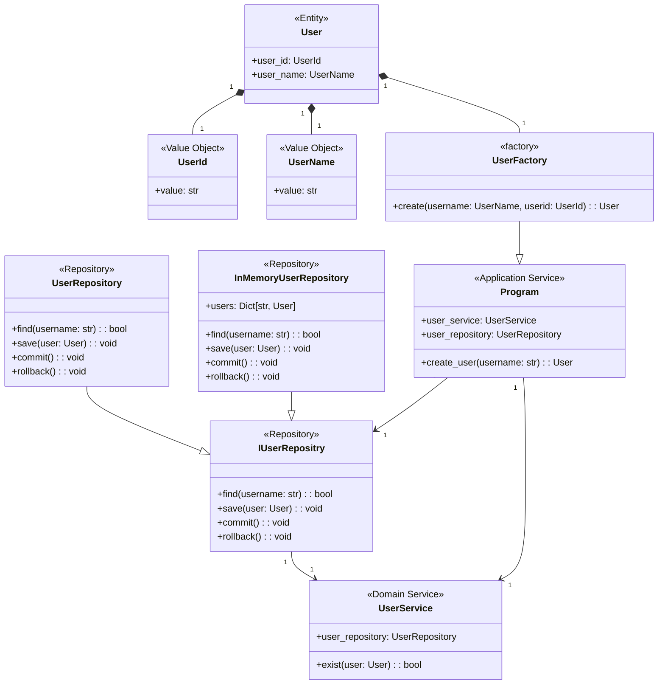

# ddd-user-registration-practice
ドメイン駆動設計を用いた架空サービスのUser登録ロジックの開発

# 使い方

flaskで実装されたRESTなAPIを使って通信を行う。詳細なhttpリクエスト設定は以下の通りとなる

| URL | メソッド | ボディ | 概要 |
| :---: | :---: | :---: | :---: |
| /register | POST | `{"name": "<ユーザー名>"}` | ユーザー登録処理 |
| /update | PUT | `{"id": "<ユーザーid>", "name": "<ユーザー名>"}` | ユーザー更新処理 |
| /delete | DELETE | `{"id": "<ユーザーid>"}` | ユーザー削除処理 |

## 実行手順

### 1. 本レポジトリをクローンする

```sh
git clone https://github.com/KoseiN38/ddd-user-registration-practice
```

### 2. Python実行環境を構築する

前提として`venv`で仮想環境を立てていることとし、構築手順はサーチしたい

```sh
pip install -r requirements.txt
```

poetryを用いてライブラリをインストールする
```sh
poetry install
```

### 3. flaskを起動する

下記を実行すると、`http://localhost:5000`でサーバーが起動するので、Brunoを用いてhttpリクエストを行う

```sh
python src/custom/interfaces/cli/main.py
```


# Diagram

## クラス設計図

ドメイン駆動設計に則って、値オブジェクト・エンティティ・ドメインサービス・アプリケーションサービス・リポジトリの各要素から相互作用し設計されている



# Note
