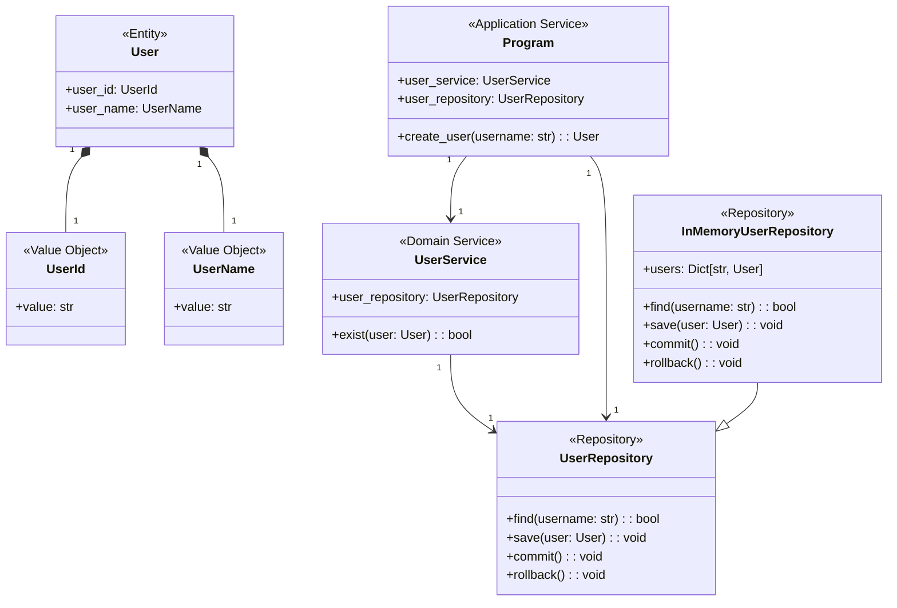

# ddd-user-registration-practice
ドメイン駆動設計を用いた架空サービスのUser登録ロジックの開発

# Diagram

## Class Diagram

ドメイン駆動設計に則って、値オブジェクト・エンティティ・ドメインサービス・アプリケーションサービス・リポジトリの各要素から相互作用し設計されている

```mermaid
classDiagram
    class UserId {
        <<Value Object>>
        +value: str
    }
    class UserName {
        <<Value Object>>
        +value: str
    }
    class User {
        <<Entity>>
        +user_id: UserId
        +user_name: UserName
    }
    class UserService {
        <<Domain Service>>
        +user_repository: UserRepository
        +exist(user: User): bool
    }
    class Program {
        <<Application Service>>
        +user_service: UserService
        +user_repository: UserRepository
        +create_user(username: str): User
    }
    class UserRepository {
        <<Repository>>
        +find(username: str): bool
        +save(user: User): void
        +commit(): void
        +rollback(): void
    }
    class InMemoryUserRepository {
        <<Repository>>
        +users: Dict[str, User]
        +find(username: str): bool
        +save(user: User): void
        +commit(): void
        +rollback(): void
    }

    User "1" *-- "1" UserId
    User "1" *-- "1" UserName
    UserService "1" --> "1" UserRepository
    Program "1" --> "1" UserService
    Program "1" --> "1" UserRepository
    InMemoryUserRepository --|> UserRepository
```
